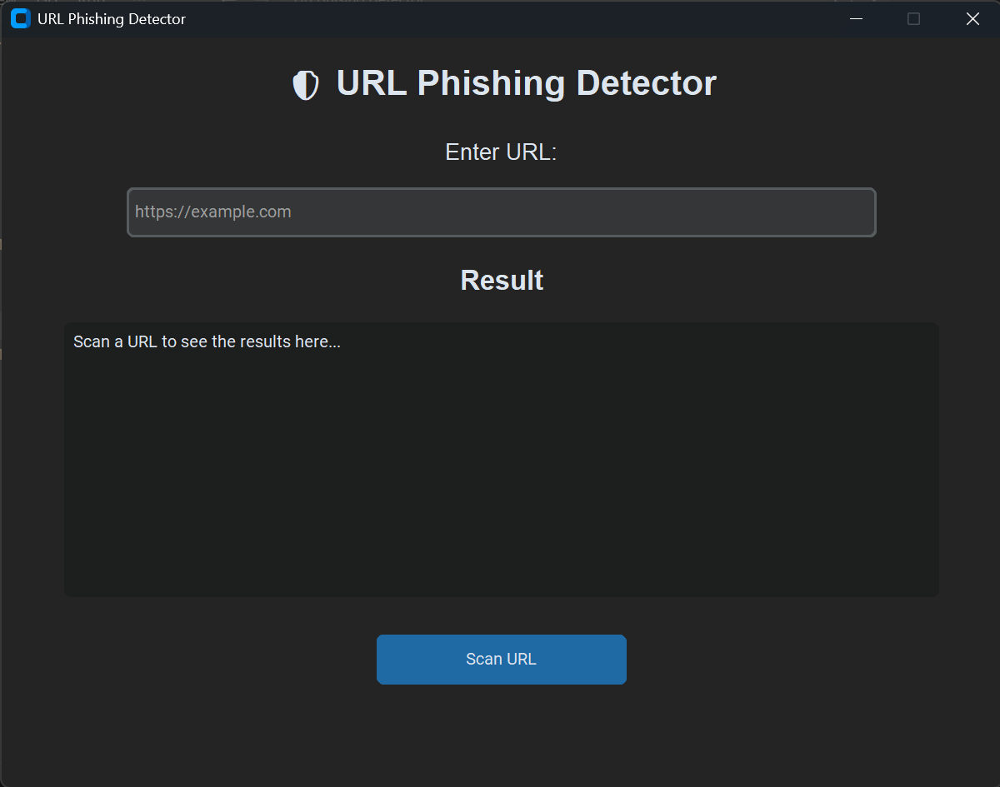
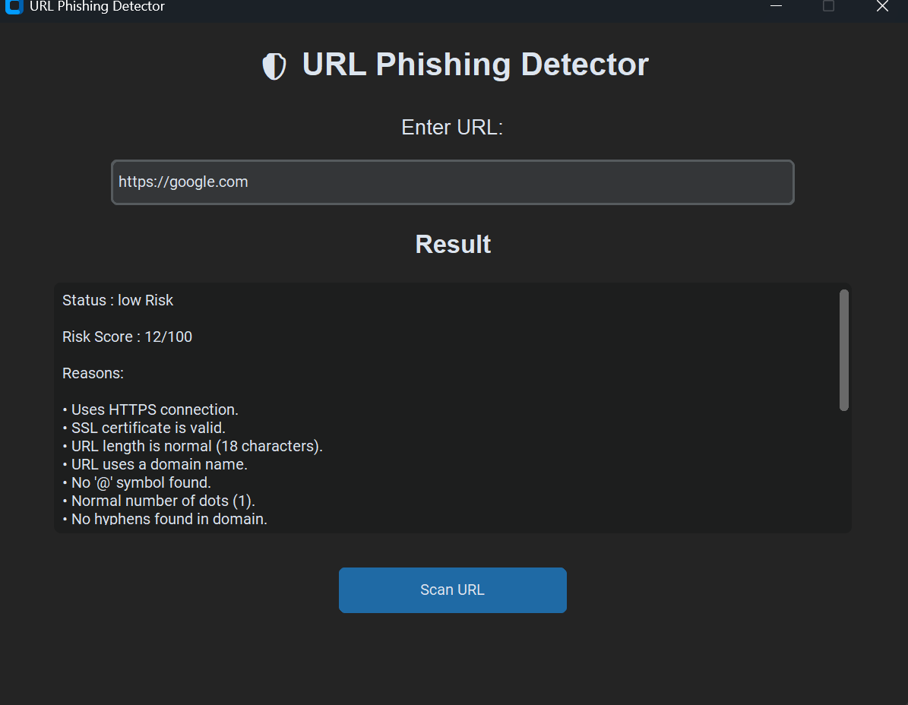
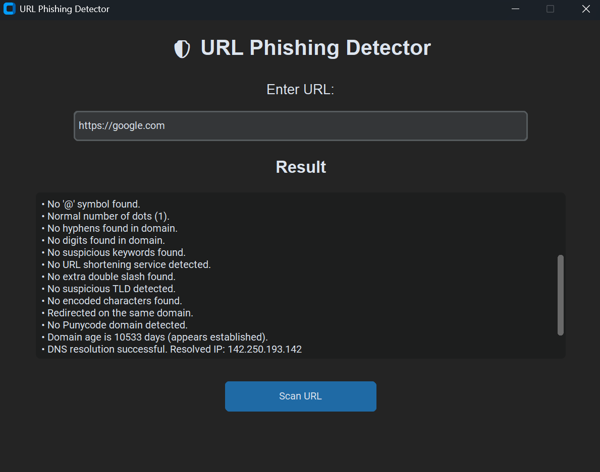

# 🛡️ URL Phishing Detector

A Python-based URL Phishing Detector with a modern CustomTkinter GUI that analyzes URLs using multiple security checks and heuristic techniques to help identify potentially malicious or phishing websites.

> ⚠️ This tool is intended for educational purposes and cybersecurity awareness. It does not guarantee that a website is safe or malicious.

---

## 📸 Screenshots

> Add screenshots of your application here.

### Home Screen


### Safe Website Scan


### Safe Website Scan (Part 2)


### High Risk Website Scan


---

# ✨ Features

The detector performs multiple security checks before assigning a risk score.

## 🚀 Key Highlights

- Modern desktop GUI built with CustomTkinter
- Multiple heuristic-based phishing detection techniques
- Domain and SSL security analysis
- HTML content inspection
- Risk scoring with detailed explanations
- Beginner-friendly and modular Python code

### URL Analysis
- ✅ URL Validation
- 🔒 HTTPS Detection
- 📏 URL Length Analysis
- 🌐 IP Address Detection
- 📧 '@' Symbol Detection
- 🔵 Dot Count Analysis
- ➖ Hyphen Detection
- 🔢 Digit Detection
- ⚠️ Suspicious Keyword Detection
- 🔗 URL Shortener Detection
- 📂 Double Slash Detection
- 🌍 Suspicious TLD Detection
- 🔤 Encoded Character Detection
- 🔄 Redirect Detection
- 🌎 Unicode / Punycode Detection

---

### Domain & Network Analysis

- 🌐 DNS Resolution Check
- 📅 WHOIS Domain Age Check
- 🔐 SSL Certificate Validation
- 🛡️ HTTP Security Headers Analysis

---

### HTML Analysis

- 🔑 Password Field Detection
- 🖼️ Hidden Iframe Detection

---

### Risk Assessment

- 📊 Risk Score (0–100)
- 🚦 Risk Classification
  - 🟢 Safe
  - 🟡 Low Risk
  - 🟠 Medium Risk
  - 🔴 High Risk

- 📝 Detailed explanation of every detected indicator

---

# 🖥️ Technologies Used

- Python 3
- CustomTkinter
- Requests
- BeautifulSoup4
- python-whois
- socket
- ssl
- urllib.parse
- re (Regular Expressions)

---

## 📋 Requirements

- Python 3.10 or later
- Internet connection

# 📦 Installation

Clone the repository

```bash
git clone https://github.com/Rahul001-lab/url-phishing-detector.git
```

Move into the project directory

```bash
cd url-phishing-detector
```

Install dependencies

```bash
pip install -r requirements.txt
```

Run the application

```bash
python main.py
```

---

# 📁 Project Structure

```
url-phishing-detector/
│
├── main.py
├── detector.py
├── url_features.py
├── requirements.txt
├── README.md
└── screenshots/
```

---

# 📊 Example Output

```
Status      : Low Risk

Risk Score  : 15/100

Reasons:

• Uses HTTPS connection.
• SSL certificate is valid.
• URL length is normal.
• Domain appears established.
• DNS resolution successful.
• Missing security headers:
  Content-Security-Policy
  Referrer-Policy
```

---

# ⚙️ Detection Techniques

This detector combines multiple heuristic techniques including:

- URL structure analysis
- SSL verification
- DNS verification
- Domain age analysis
- HTTP security header inspection
- HTML element analysis
- Redirect detection
- Risk scoring system

Rather than relying on a single check, the detector combines several indicators to estimate the likelihood that a URL may be malicious.

---

# 📈 Future Improvements (Version 2.0)

- Improved weighted risk scoring
- Advanced HTML analysis
- JavaScript behavior analysis
- Machine Learning based detection
- Domain reputation integration
- VirusTotal API integration
- Phishing blacklist integration
- Export reports (PDF/CSV)
- Dark/Light theme support
- Machine Learning based detection
---

# ⚠️ Disclaimer

This project is developed for educational purposes only.

It should not be considered a replacement for professional security software or browser protection mechanisms.

Always verify suspicious websites using multiple trusted security tools.

# 📄 License

This project is licensed under the MIT License.

---

# 👨‍💻 Author

**Rahul Tewatia**

B.Tech CSE Student

Cybersecurity & Python Enthusiast

GitHub: https://github.com/Rahul001-lab

---

# ⭐ Support

If you found this project useful, consider giving it a ⭐ on GitHub.
